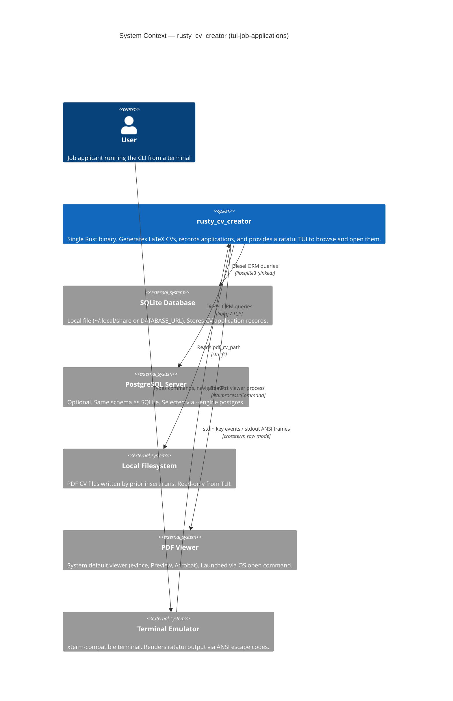
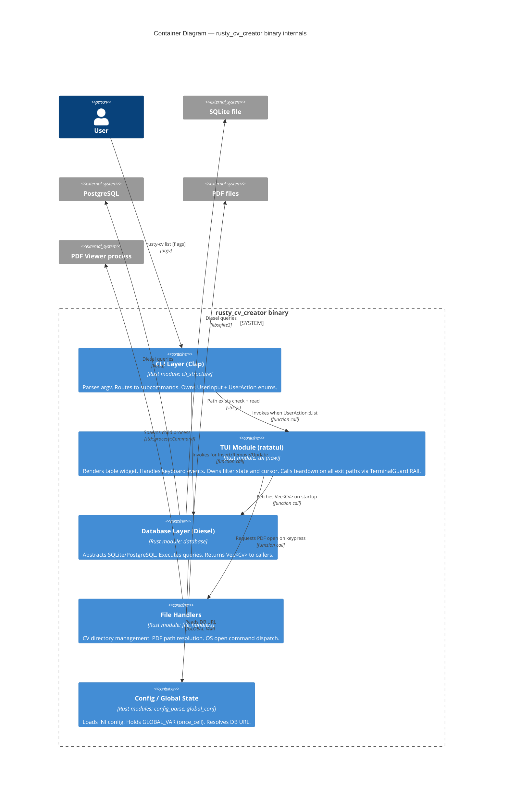
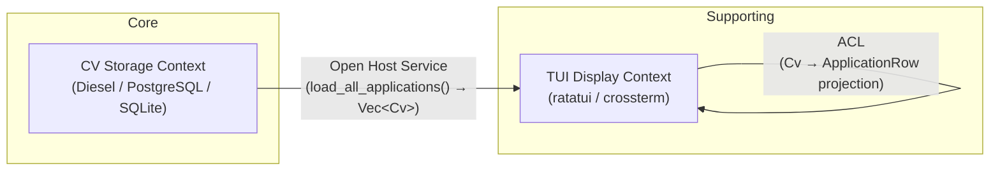
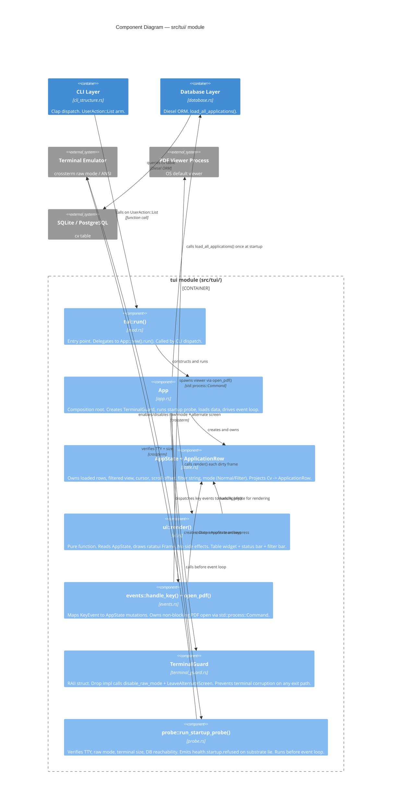

## Wave: DESIGN / [REF] System Architecture

Feature: `tui-job-applications` — ratatui-based interactive TUI for `rusty-cv list`
Binary: `rusty_cv_creator` v4.0.2
Date: 2026-06-06

---

### 1. Deployment Topology

Single self-contained binary. No servers, no network services, no daemons. The user installs one executable (compiled with `cargo install` or distributed as a release artifact) and invokes it from a terminal. All state lives in a local database file (SQLite default, PostgreSQL optional) and a local filesystem directory containing generated PDF CVs. There is nothing to deploy, replicate, or scale horizontally.

**Trade-off accepted**: choosing a local-only architecture gives zero operational overhead and zero network attack surface, at the cost of no multi-device sync and no concurrent multi-user access. This is the correct trade-off for a personal CV tool.

---

### 2. System Context

External systems the binary interacts with at runtime:

| External System | Protocol / Mechanism | Direction | Notes |
|---|---|---|---|
| SQLite file (`~/.local/share/rusty-cv/cv.db` or `DATABASE_URL`) | Diesel ORM over libsqlite3 (linked statically) | Read + Write | Default engine; file-local, no daemon |
| PostgreSQL server (optional) | Diesel ORM over TCP (libpq) | Read + Write | Selected via `--engine postgres`; requires `DATABASE_URL` env var |
| Local filesystem (PDF CV files) | `std::fs` / `std::path` | Read | Paths stored in `pdf_cv_path` column; files created by prior `insert` runs |
| OS process launcher (`xdg-open` / `open` / `start`) | `std::process::Command` | Write (spawn) | Opens PDF in the user's default viewer; platform-specific |
| Terminal (stdin/stdout via crossterm) | ANSI escape sequences + raw mode | Read + Write | ratatui renders to stdout; crossterm reads key events from stdin |
| OS signal subsystem | libc `SIGINT` / `SIGTERM` | Read | Must restore terminal raw mode on exit; handled via `ctrlc` crate or signal hook |

No outbound HTTP. No cloud APIs. No IPC sockets.

---

### 3. Quality Attribute Priorities

These are the binding non-functional constraints for `tui-job-applications`, in priority order:

| Priority | Attribute | Target | Rationale |
|---|---|---|---|
| 1 | Startup-to-first-render latency | < 500 ms on spinning-disk hardware | DB query + ratatui initial render must complete before user sees a blank screen |
| 2 | Terminal portability | All terminals supported by crossterm (xterm-256color, tmux, Windows Terminal, iTerm2, kitty) | `crossterm` is already the standard backend for ratatui; no raw ANSI assumptions |
| 3 | Zero new system binary dependencies | No `fzf`, `less`, `bat`, `pdftotext` or any external binary required at runtime | The binary must work on a fresh machine with only the PDF viewer already installed |
| 4 | Correct terminal state restoration | Terminal must return to normal mode on any exit path (panic, SIGINT, SIGTERM, normal quit) | Failure here corrupts the user's shell session — unacceptable UX |
| 5 | Memory footprint | < 50 MB RSS with 10 000 CV rows loaded | Entire application dataset fits comfortably in memory; no streaming needed |

**Back-of-envelope for latency budget:**
- DB query (SQLite, 10 000 rows, indexed): ~5–15 ms (disk seek + sequential read of ~3 MB)
- ratatui first frame render (table widget, ~30 visible rows): ~1–3 ms (terminal escape seq write, no GPU)
- crossterm terminal setup (raw mode + alternate screen): ~1 ms
- Clap parse + config load: ~2–5 ms
- **Total estimated cold path: ~10–25 ms** — well inside the 500 ms budget even on slow hardware

The 500 ms budget exists as a guard against accidentally loading all PDF file metadata from disk on startup. Mitigation: load only DB rows at startup; resolve PDF paths lazily on user action (open key).

---

### 4. System-Level Constraints

#### 4.1 Terminal Raw Mode Lifecycle

ratatui requires `crossterm` to enable raw mode and switch to an alternate screen buffer before rendering. This creates a lifecycle obligation:

```
main()
  └─ TuiApp::run()
       ├─ crossterm::terminal::enable_raw_mode()          // MUST be undone
       ├─ crossterm::execute!(stdout, EnterAlternateScreen)  // MUST be undone
       ├─ event loop (blocking poll)
       └─ TuiApp::teardown()
            ├─ crossterm::execute!(stdout, LeaveAlternateScreen)
            └─ crossterm::terminal::disable_raw_mode()
```

Teardown MUST run on all exit paths. Implementation constraint: wrap in a RAII guard (`struct TerminalGuard`) whose `Drop` impl calls teardown. This prevents silent terminal corruption on panic.

**Substrate lie to probe**: `enable_raw_mode()` succeeds even when stdout is not a TTY (e.g., when output is piped). The startup probe must call `crossterm::terminal::is_raw_mode_enabled()` after enabling and abort with a clear error if the binary is not attached to a real terminal.

#### 4.2 Signal Handling (SIGINT / SIGTERM)

Rust's default SIGINT handler terminates the process without running `Drop`. On a raw-mode terminal this leaves the shell in a broken state.

Constraint: register a signal handler (via `ctrlc` crate or `signal-hook`) that sets an atomic flag; the event loop checks this flag each tick and calls `TuiApp::teardown()` before exiting. The `TerminalGuard` RAII guard provides a second line of defence.

#### 4.3 Synchronous Event Loop (no async runtime)

The existing codebase uses no async runtime (no `tokio`, no `async-std`). The TUI event loop must be synchronous:

```
loop {
    if crossterm::event::poll(Duration::from_millis(16))? {  // ~60 fps ceiling
        match crossterm::event::read()? { ... }
    }
    if state.dirty { terminal.draw(|f| ui::render(f, &state))?; }
    if state.should_quit { break; }
}
```

**Trade-off accepted**: synchronous polling at 16 ms tick is sufficient for a keyboard-driven table navigator with no animations. Introducing `tokio` purely for the TUI event loop would add ~500 KB to the binary and unnecessary complexity. If background DB queries are ever needed (large PostgreSQL dataset), a `std::thread` + `std::sync::mpsc` channel is the correct escalation path, not an async runtime.

#### 4.4 PDF Open: OS Process Spawn

Opening a PDF spawns a child process (`xdg-open` on Linux, `open` on macOS, `start` on Windows) via `std::process::Command::new(...).arg(path).spawn()`. Constraints:
- Spawn must be non-blocking (`spawn()`, not `output()`) — the TUI must remain responsive.
- The spawned process is intentionally orphaned; the binary does not wait for the viewer to close.
- If the path stored in the DB no longer exists on disk, the TUI must show an inline error row, not panic. Validate path existence before spawning.

#### 4.5 In-process Filter State (no separate filter process)

The existing `rusty-cv list` currently delegates fuzzy search to `skim` (an fzf-like library) via `my_fzf()`. The ratatui TUI replaces this with an in-process filter: a text input widget feeds a filter string; the table widget renders only rows where `company` or `job_title` contains the filter string (case-insensitive substring match). No external `fzf` binary is invoked in TUI mode.

**Constraint**: the `skim` dependency remains for non-TUI code paths (e.g., `remove_cv`). The TUI code path must branch before calling `my_fzf()`.

---

### 5. C4 System Context Diagram



---

### 6. C4 Container Diagram

This is a single binary. "Containers" in C4 terms map to the major runtime modules within the process.



---

### 7. Startup Probe Contract

Per the Earned Trust principle, the TUI module MUST execute a startup probe before entering the event loop. The probe verifies substrate claims that are known to silently lie:

| Substrate claim | Known lie scenario | Probe |
|---|---|---|
| `enable_raw_mode()` succeeded | stdout is a pipe, not a TTY | Assert `is_raw_mode_enabled()` returns `true`; refuse to start if false |
| `pdf_cv_path` values are valid | User moved files after insertion | Probe is deferred to open-time (lazy), not startup — probing all paths at startup on 10 000 rows would blow the latency budget |
| DB file is readable and schema is current | Corrupted file, schema migration not run | Execute `SELECT COUNT(*) FROM cv LIMIT 1` before first render; surface structured error on failure |
| Terminal size is available | No `COLUMNS`/`LINES` and `ioctl` fails (some CI terminals) | Assert `crossterm::terminal::size()` returns `Ok((w, h))` with `w > 0` and `h > 0`; refuse with `health.startup.refused: terminal_size_unavailable` |

A probe failure emits a structured log event `health.startup.refused` with the specific lie detected (not a generic panic) and suggests a corrective action (e.g., "run in a real terminal, not a pipe").

---

*Domain Model and Application Architecture sections will be added by ddd-architect and solution-architect in subsequent wave steps.*

---

## Wave: DESIGN / [REF] Domain Model

Feature: `tui-job-applications` — ratatui-based interactive TUI for `rusty-cv list`
Date: 2026-06-06

---

### 1. Bounded Contexts

This is a small single-binary CLI. Two bounded contexts are in play. They are not separate deployables — they are distinct conceptual boundaries within the same process, each with its own language and model shape.

| Context | Subdomain Type | Responsibility |
|---|---|---|
| **CV Storage** | Core | Owns the canonical `Cv` record: insert, update, remove, persist. Diesel ORM is the infrastructure concern of this context. The model is defined by the database schema. |
| **TUI Display** | Supporting | Owns the interactive presentation of CV application records. Reads data only. Manages navigation state, filter input, and cursor position. Knows nothing about persistence. |

**Why two contexts, not one?** The vocabulary diverges at the boundary. In CV Storage, `pdf_cv_path` is a database column — a raw string that may be empty or stale. In TUI Display, the equivalent concept is `pdf_status` — a display-level indicator (available / missing / not-generated) derived from a filesystem existence check. The same data field means different things to each context. That language divergence is the boundary signal.

**Subdomain classification rationale**: CV Storage is Core because the act of tracking job applications with associated generated PDFs is the primary differentiator of this tool. TUI Display is Supporting because it enables the core workflow but provides no unique competitive advantage — it is a presentation layer.

---

### 2. Aggregate: JobApplication

The `Cv` struct in `src/models.rs` is the sole aggregate in the CV Storage context. It maps 1:1 to the `cv` table. The name `Cv` is a legacy technical name; the domain concept is a **Job Application** — the fact that a person applied for a specific role at a specific company on a specific date, and optionally generated a PDF CV for that application.

**Identity**: `id: i32` — database-assigned surrogate key. Immutable after creation.

**Aggregate boundary**: This aggregate contains only a root entity with value-typed properties. It satisfies Vernon's Rule 2 (small aggregates) and Rule 1 (all fields share the same consistency boundary — an application record is created and mutated as a whole unit). There are no child entities. There is nothing to split.

**Invariants enforced in CV Storage context**:

| Invariant | Rule |
|---|---|
| No duplicate application | `(job_title, company, quote)` triple must be unique — enforced in `check_if_entry_exists()` before insert |
| `pdf_cv_path` is a non-empty string | Set at insert time; an empty path is a valid sentinel meaning "CV not yet generated" but the field must be present |
| `generated` reflects PDF existence at insert time | Set to `true` when the PDF was created during the insert run; not revalidated on subsequent reads |

**Domain concern flagged**: The `generated` flag is set once at insert time and is never updated. By the time the TUI reads the record, the flag may be stale (PDF deleted, moved, or never actually written). The TUI Display context must not trust `generated` as evidence of file availability. It must perform a lazy filesystem existence check at open-time (as the system architect correctly specified in section 7 of the System Architecture). This is a data consistency gap in the CV Storage context's invariant model — the `generated` flag is aspirational, not authoritative.

**Write model (CV Storage context)**: The full `Cv` struct and `NewCv` insertable — owned entirely by the database layer. The TUI never touches this.

---

### 3. Context Map



**Relationship: CV Storage -> TUI Display: Open Host Service**

`read_cv_from_db` (or its successor) provides a well-defined query interface that returns all `Cv` records. It is the upstream provider. The TUI is one consumer; `remove_cv` is another. The interface is not negotiated per-consumer — it is a shared loading function. This is the OHS pattern: a stable, reusable host interface for multiple downstream consumers.

**Relationship: Within TUI Display — ACL projection**

The TUI Display context does not consume raw `Cv` structs in its rendering logic. It translates them through an Anti-Corruption Layer into `ApplicationRow` (defined in section 5 below). This protects the TUI's display model from the persistence model's concerns (nullable dates as raw strings, opaque `generated` flag, raw filesystem paths). The ACL is the mapping function `Cv -> ApplicationRow`.

**Why not Conformist?** A Conformist relationship would have the TUI rendering logic directly reference `Cv` fields — binding the display layer to the ORM struct. Any schema migration (adding a column, renaming a field) would require changes throughout the TUI. The ACL gives the TUI freedom to evolve its display model independently.

---

### 4. Ubiquitous Language

Terms are scoped per context. The same word in two contexts is intentionally different.

#### CV Storage Context

| Term | Definition |
|---|---|
| **Job Application** | The domain concept represented by a `Cv` record. The fact of having applied for a specific role at a specific company. The struct name `Cv` is a technical alias; prefer "application" in domain discussion. |
| **Application Date** | The calendar date on which the application was submitted. Stored as an optional `String` in ISO 8601 format (`YYYY-MM-DD`). `None` means the date was not recorded at insert time. |
| **PDF CV Path** | The absolute filesystem path to the generated PDF document associated with the application. A non-empty string. May be stale. Not validated at read time. |
| **Generated** | A boolean flag set to `true` when a PDF was produced during the insert run. Not a live filesystem check. Treat as "was generated at insert time." |

#### TUI Display Context

| Term | Definition |
|---|---|
| **Application Row** | The display-ready projection of a Job Application. The unit of data the TUI table renders. Typed for display, not for persistence. Defined in section 5. |
| **Filter** | A user-entered string (via a text input widget) applied as a case-insensitive substring match against `job_title` and `company` fields. Reduces the visible set of Application Rows without discarding loaded data. |
| **Selection** | The Application Row currently highlighted by the cursor in the table widget. The target of keyboard actions (open PDF, future: copy, inspect). Identified by cursor position, not by `id`. |
| **PDF Status** | A display-level enumeration (`Available`, `Missing`, `NotGenerated`) derived lazily from the `pdf_cv_path` and `generated` fields. Displayed in the table; computed on demand when the user attempts to open a PDF. Not stored. |
| **Viewport** | The visible slice of Application Rows within the terminal window. Scroll state moves the viewport over the full loaded dataset. |

---

### 5. Read Model: ApplicationRow

The TUI Display context consumes this struct, not the raw `Cv` ORM struct. This is the ACL projection.

```rust
/// Read model for the TUI Display context.
/// Projected from Cv at load time. Never written back to the database.
pub struct ApplicationRow {
    /// Surrogate key from the database. Used to correlate back to the
    /// source record (e.g., for future write operations). Never displayed directly.
    pub id: i32,

    /// Human-readable application date. "Unknown" when application_date is None.
    /// Formatted for display (no ISO parsing in the rendering layer).
    pub application_date: String,

    /// Role applied for. Displayed in the Job Title column.
    pub job_title: String,

    /// Organisation applied to. Displayed in the Company column.
    pub company: String,

    /// Absolute path to the PDF CV file. Passed to the OS open command on keypress.
    /// Existence is validated lazily at open-time, not at projection time.
    pub pdf_cv_path: String,

    /// Whether a PDF was generated at insert time. Used as a hint to pre-populate
    /// PdfStatus without a filesystem check. The authoritative check is filesystem-level.
    pub pdf_generated: bool,
}
```

**Projection rules (Cv -> ApplicationRow)**:

| ApplicationRow field | Source | Transform |
|---|---|---|
| `id` | `Cv.id` | Identity |
| `application_date` | `Cv.application_date` | `Some(s) => s`, `None => "Unknown"` |
| `job_title` | `Cv.job_title` | Identity |
| `company` | `Cv.company` | Identity |
| `pdf_cv_path` | `Cv.pdf_cv_path` | Identity |
| `pdf_generated` | `Cv.generated` | Identity (renamed for clarity) |

**Fields intentionally excluded from ApplicationRow**:

| Cv field | Reason for exclusion |
|---|---|
| `quote` | The motivational quote is a CV generation input, not a browsing attribute. Displaying it in the table adds noise. Omit in this feature scope; surface in a detail panel if a future feature adds one. |

**Domain concern for implementation**: `read_cv_from_db` in `src/database.rs` currently returns `Vec<String>` (only `pdf_cv_path` values). The TUI requires `Vec<Cv>` (the full record). A new query function `load_all_applications() -> Result<Vec<Cv>, ...>` must be added to the database layer. The existing `read_cv_from_db` should not be modified — it is used by the `remove_cv` flow which expects strings. This is a **clear interface gap** that the solution-architect and software-crafter must address: two separate query functions, one per use case.

---

### 6. Domain Concerns Affecting TUI Implementation

Three concerns identified during analysis that have direct implementation consequences:

**1. The `generated` flag is not a reliable PDF availability signal.**
The TUI must not render a "PDF available" indicator based solely on `Cv.generated`. Filesystem existence must be checked lazily at open-time via `std::fs::metadata(path).is_ok()`. This is consistent with the system architect's startup probe contract (section 7 of System Architecture) which already defers path validation to open-time.

**2. `read_cv_from_db` returns `Vec<String>`, not `Vec<Cv>`.**
The existing database query function discards all fields except `pdf_cv_path`. A new `load_all_applications()` function returning `Vec<Cv>` is required. This is not a domain model decision — it is a gap in the current infrastructure that the domain model surface reveals.

**3. `application_date` is an `Option<String>` with no enforced format.**
The display layer must handle `None` gracefully ("Unknown") and must not attempt to parse or reformat the string — doing so risks a panic on malformed historical data. Render the raw string as-is when present.

---

## Wave: DESIGN / [REF] Application Architecture

Feature: `tui-job-applications` — ratatui-based interactive TUI for `rusty-cv list`
Date: 2026-06-06
ADRs: [ADR-001](adr-001-tui-library-ratatui.md) | [ADR-002](adr-002-tui-module-structure.md)

---

### 1. Architectural Style

**Modular monolith with ports-and-adapters (hexagonal) within the single binary.**

The binary is already a modular monolith; no new deployment units are introduced. The TUI feature adds one new module (`src/tui/`) that wires into the existing CLI dispatch path via the driving port (`UserAction::List`). All dependency arrows point inward: `tui/` depends on `database` and `helpers` for driven ports, but neither `database` nor `helpers` depends on `tui/`. The write path (`cv_insert`, `user_action`) is deliberately isolated; `src/tui/` has zero imports from `src/cv_insert.rs`.

**Paradigm: OOP-leaning (structs + `impl` blocks).**

The existing codebase expresses behaviour through structs with `impl` blocks (`GLOBAL_VAR`, `UserInput`, `Cv`, `NewCv`). The TUI module follows the same idiom: `App`, `TerminalGuard`, and `AppState` are structs with methods. Heavy FP pipelines (iterator chains as primary control flow, type-class emulation) are not idiomatic here and would diverge from codebase conventions. The single functional concession is the `Cv -> ApplicationRow` projection, which is a pure mapping function — appropriate and conventional in Rust.

**Justification over alternatives (documented in ADR-001 and ADR-002).**

Two simpler alternatives were evaluated and rejected:
- *Extend `user_action::show_cvs` to print a formatted table*: rejected — no keyboard navigation, no filter, no PDF open; cannot address US-02 through US-04. Addresses only ~25% of the feature scope.
- *Use `my_fzf` (skim) for listing + PDF open*: rejected — `skim` has no table widget, no column layout, no status bar. It satisfies JOB-02 (filter) only. Already present in codebase but architecturally unsuitable for the full feature.

---

### 2. Reuse Analysis

**Hard gate: every existing component classified before any new component is specified.**

| Existing Component | Location | Decision | Justification |
|---|---|---|---|
| `UserAction::List` handler in `match_user_action` | `src/cli_structure.rs:78` | **EXTEND** | The `List` arm currently returns a debug string. It must be extended to call `tui::run()` instead. No new CLI surface. The `FilterArgs` struct it receives is passed through (for future use) but currently unused by the TUI — the TUI loads all rows at startup. |
| `read_cv_from_db` | `src/database.rs:144` | **DO NOT MODIFY** | Returns `Vec<String>` (only `pdf_cv_path`). Used by `remove_cv` via `show_cvs` → `my_fzf`. Modifying it breaks the remove flow. A new companion function `load_all_applications` is added alongside it. |
| `view_cv_file` | `src/helpers.rs:96` | **DO NOT REUSE DIRECTLY** | `view_cv_file` reads a config file to determine the PDF viewer binary name and constructs a `.tex`-to-`.pdf` path substitution. The TUI's PDF open action works differently: it has a direct `pdf_cv_path` (already `.pdf`), does not need config lookup, and must stay non-blocking. The TUI's `open_pdf` adapter in `src/tui/events.rs` implements OS-level `std::process::Command` spawn directly, reusing the platform-dispatch pattern but not the function. |
| `Cv` model (struct) | `src/models.rs:4` | **REUSE AS-IS** | `Cv` is the output of `load_all_applications`. The TUI receives `Vec<Cv>` from the database layer. The ACL (`Cv -> ApplicationRow`) is a projection function in `src/tui/state.rs`; `Cv` itself is not modified. |
| `establish_connection_postgres` | `src/database.rs:32` | **REUSE AS-IS** | `load_all_applications` calls this connection factory, identical to existing usage. No change required. |
| `fix_home_directory_path` | `src/helpers.rs:16` | **REUSE AS-IS** | Used in `load_all_applications` if needed for path expansion. Already public; no change required. |
| `my_fzf` | `src/helpers.rs:133` | **NOT USED IN TUI PATH** | `skim` dependency stays for `remove_cv`. The TUI implements in-process filter state (see System Architecture §4.5). `my_fzf` is not called from any `src/tui/` file. |
| `GLOBAL_VAR` / `get_global_var` | `src/global_conf.rs` | **REUSE AS-IS** | `load_all_applications` reads DB URL via the same `GLOBAL_VAR` mechanism as existing database functions. No change required. |

---

### 3. Component Decomposition — `src/tui/` Module Tree

New files created under `src/tui/`. All existing files are untouched except as noted in the Reuse Analysis above and the upstream changes in §4.

| File | Responsibility | Key Types / Functions |
|---|---|---|
| `src/tui/mod.rs` | Module root. Declares sub-modules. Exports `run()` entry point called from `cli_structure.rs`. | `pub fn run() -> Result<(), Box<dyn std::error::Error>>` |
| `src/tui/app.rs` | Owns `App` struct. Composition root for the TUI: creates `TerminalGuard`, loads data, runs the event loop. | `pub struct App { state: AppState, terminal: Terminal<CrosstermBackend<Stdout>> }` |
| `src/tui/state.rs` | Owns `AppState` struct and `ApplicationRow` read model. Owns filter logic, cursor, scroll offset, and the `Cv -> ApplicationRow` projection. | `pub struct AppState`, `pub struct ApplicationRow`, `fn project(cv: Cv) -> ApplicationRow` |
| `src/tui/ui.rs` | Pure rendering function. Accepts `&AppState`, returns nothing (draws to the ratatui `Frame`). Zero side effects. | `pub fn render(frame: &mut Frame, state: &AppState)` |
| `src/tui/events.rs` | Handles crossterm keyboard events. Maps `KeyEvent` to state mutations on `AppState`. Also owns `open_pdf()` (non-blocking OS process spawn). | `pub fn handle_key(event: KeyEvent, state: &mut AppState)`, `pub fn open_pdf(path: &str) -> Result<(), String>` |
| `src/tui/terminal_guard.rs` | RAII guard for terminal raw mode lifecycle. `Drop` impl calls `disable_raw_mode` + `LeaveAlternateScreen`. | `pub struct TerminalGuard`, `impl Drop for TerminalGuard` |
| `src/tui/probe.rs` | Startup probe. Verifies TTY attachment, raw mode activation, terminal size, and DB reachability before the event loop starts. Emits `health.startup.refused` on failure. | `pub fn run_startup_probe() -> Result<(), StartupError>` |

**Modified existing files** (minimal surgical changes only):

| File | Change |
|---|---|
| `src/cli_structure.rs` | `UserAction::List` arm in `match_user_action` calls `tui::run()` instead of returning a debug string. |
| `src/database.rs` | Add `pub fn load_all_applications() -> Result<Vec<Cv>, Box<dyn std::error::Error>>`. Add `pub fn establish_connection(engine: &str) -> Result<...>` shared factory that dispatches to SQLite or PostgreSQL based on the engine argument. `load_all_applications` calls the shared factory. `read_cv_from_db` is untouched. **Note**: this is a pre-slice-01 prerequisite — the default engine is SQLite; using `establish_connection_postgres` directly in `load_all_applications` would break the majority of users. |
| `src/main.rs` | Add `mod tui;` declaration. |
| `Cargo.toml` | Add `ratatui = "0.30"`, `crossterm = "0.28"`, `ctrlc = "3.4"`. (**Note**: `skim` has a transitive dep on `ratatui ^0.30.0` which requires Rust ≥1.88. See DISTILL UC-1.) |

---

### 4. Ports and Adapters

#### 4.1 Driving Port (Primary / Inbound)

| Port | Invoker | Contract |
|---|---|---|
| `tui::run()` | `cli_structure::match_user_action` (the `UserAction::List` arm) | Called synchronously after CLI parse and global var setup. Returns `Result<(), Box<dyn std::error::Error>>`. Caller propagates error to `main`. |

The `FilterArgs` struct from the `List` arm is available but currently unused by the TUI (in-process filter supersedes CLI filter arguments for the table display). It is passed as a parameter to `tui::run(FilterArgs)` to preserve the signature for future use (e.g., pre-populating the filter bar from a CLI flag).

#### 4.2 Driven Ports (Secondary / Outbound)

| Port (interface) | Adapter (implementation) | Location | Notes |
|---|---|---|---|
| Load all applications | `database::load_all_applications()` | `src/database.rs` (new function) | Returns `Vec<Cv>`. Called once at TUI startup, before event loop. Blocks; synchronous. |
| Open PDF file in OS viewer | `tui::events::open_pdf(path)` | `src/tui/events.rs` | `std::process::Command::new(os_open_cmd).arg(path).spawn()`. Non-blocking. Platform-dispatched (Linux: `xdg-open`, macOS: `open`, Windows: `cmd /c start`). |
| Terminal raw mode | crossterm `enable_raw_mode` / `disable_raw_mode` | `src/tui/terminal_guard.rs` | Wrapped in `TerminalGuard`. Probed in `src/tui/probe.rs`. |
| Terminal size query | crossterm `terminal::size()` | `src/tui/probe.rs` | Probed at startup; result used to configure scroll offset. |
| SIGINT / SIGTERM | `ctrlc` crate handler | `src/tui/app.rs` (registration) | Sets `AtomicBool` flag; event loop checks each tick. |

---

### 5. Technology Stack

| Component | Choice | Version | License | Rationale |
|---|---|---|---|---|
| TUI rendering | `ratatui` | 0.30 | MIT | De-facto standard for Rust TUIs. `crossterm` backend already a transitive dep via `skim`. Version changed from 0.29 → 0.30 per DISTILL UC-1: `skim` pins `ratatui ^0.30.0`; using 0.29 creates a two-version conflict. **Requires Rust ≥1.88** (available in devenv). See ADR-001. |
| Terminal I/O | `crossterm` | 0.28 | MIT | ratatui's default backend. Handles raw mode, alternate screen, key event polling. Already in the transitive dependency tree. |
| Signal handling | `ctrlc` | 3.4 | MIT/Apache-2.0 | Minimal crate. Registers a SIGINT handler with an `AtomicBool` flag. Zero unsafe outside the crate. `signal-hook` is the alternative (more capable but more complex; overkill for single-flag SIGINT). |
| Database ORM | `diesel` | existing | MIT/Apache-2.0 | Already present. `load_all_applications` uses the same Diesel patterns as existing query functions. No version change. |
| Async runtime | none | — | — | Synchronous event loop at 16 ms tick is sufficient. No `tokio`. Avoids ~500 KB binary size increase. See System Architecture §4.3. |

**License summary**: all new dependencies are MIT or MIT/Apache-2.0 dual-licensed. No GPL, LGPL, or proprietary licenses introduced.

**OSS preference validation**: all choices are free, open source, and well-maintained (last ratatui release < 6 months at time of writing; crossterm and ctrlc are stable, widely-used crates). Zero proprietary dependencies.

---

### 6. C4 Component Diagram — `tui` Module



---

### 7. Earned Trust: Adapter Probe Contracts

Per the Earned Trust principle, every driven adapter specifies how it demonstrates it can honour its contract in the real environment. This extends the probe table defined in System Architecture §7.

#### 7.1 `TerminalGuard` / crossterm adapter

| Layer | Mechanism |
|---|---|
| Subtype check | `probe.rs` calls `crossterm::terminal::is_raw_mode_enabled()` after `enable_raw_mode()` and returns `Err(StartupError::NotATty)` if false. Compile-time: `TerminalGuard::new()` returns `Result`, making the error path non-optional at the call site. |
| Structural check | Pre-commit AST hook (to be specified in CI by platform-architect) walks `terminal_guard.rs` and asserts `impl Drop for TerminalGuard` is present and contains `disable_raw_mode` call. |
| Behavioral check | CI gold test: pipe `rusty-cv list` through `\| cat` (stdout is not a TTY). Assert exit code is non-zero and stderr contains `health.startup.refused: not_a_tty`. |

**Known substrate lie**: `enable_raw_mode()` returns `Ok(())` even when stdout is piped. The probe catches this.

#### 7.2 `load_all_applications` / database adapter

| Layer | Mechanism |
|---|---|
| Subtype check | Return type is `Result<Vec<Cv>, Box<dyn std::error::Error>>`. Compiler enforces error handling at every call site. |
| Structural check | `probe.rs` executes `SELECT COUNT(*) FROM cv LIMIT 1` before the event loop. Any DB connectivity or schema issue surfaces as `StartupError::DbUnreachable` before the user sees a blank screen. |
| Behavioral check | CI gold test with an empty SQLite fixture file: assert TUI renders the "No applications" empty state (AC-02) without panicking. |

#### 7.3 `open_pdf` / OS process adapter

| Layer | Mechanism |
|---|---|
| Subtype check | Return type is `Result<(), String>`. Caller in `events.rs` matches on `Err` and writes to `AppState.status_message` (shown in status bar). Never panics. |
| Structural check | `std::fs::metadata(path).is_ok()` is called before `Command::spawn()`. Missing file produces `AppState.status_message = "File not found: <path>"` (AC-16). |
| Behavioral check | CI gold test: invoke `open_pdf` with a path to a non-existent file. Assert return is `Err`, assert status message contains "File not found". |

---

### 8. Architectural Enforcement

**Language-appropriate tooling recommendation:**

| Rule | Enforcement Tool | Rule Specification |
|---|---|---|
| `src/tui/` must not import from `src/cv_insert.rs` | `cargo-deny` + custom `import-linter` equivalent via `cargo-modules` | Assert no path from `tui::*` to `cv_insert::*` in the dependency graph |
| `ui::render()` must have zero mutable state | `clippy::no_effect` + manual review | `render` function signature takes `&AppState` (not `&mut`); enforced at compile time by borrow checker |
| `TerminalGuard` must implement `Drop` | AST pre-commit hook (rustfmt + custom grep) | Fail pre-commit if `src/tui/terminal_guard.rs` lacks `impl Drop for TerminalGuard` |
| No `panic!` in `src/tui/` | `clippy::panic` lint | Add `#![deny(clippy::panic)]` at top of each `src/tui/*.rs` file |
| All driven adapters return `Result` | Rust type system | Enforced at compile time; `unwrap()`/`expect()` banned via `clippy::unwrap_used` in `src/tui/` |
| `App` struct field order: `terminal` before `_guard` | Pre-commit AST hook | Walk `src/tui/app.rs` struct definition; assert `terminal` field appears before `_guard: TerminalGuard` field. Incorrect order causes terminal to drop after raw mode is disabled, corrupting the shell session. No compile-time warning from the Rust compiler for this class of error. |

---

### 9. ADR References

| ADR | Decision | File |
|---|---|---|
| ADR-001 | TUI library selection: ratatui over crossterm-raw, cursive, termion | `docs/product/architecture/adr-001-tui-library-ratatui.md` |
| ADR-002 | `src/tui/` internal module structure and RAII TerminalGuard pattern | `docs/product/architecture/adr-002-tui-module-structure.md` |

---

### 10. Open Questions Deferred to DISTILL / DELIVER

| # | Question | Impact | Deferred To |
|---|---|---|---|
| OQ-01 | Should `tui::run()` accept `FilterArgs` and pre-populate the filter bar from CLI flags (e.g., `rusty-cv list --company acme`)? | Low — UX enhancement only. No structural change to architecture. | DISTILL / slice 03 |
| OQ-02 | ~~Promoted to upstream change~~ — see §3 Modified existing files and §4.2. `load_all_applications` must call a shared `establish_connection(engine)` factory rather than the PostgreSQL-only `establish_connection_postgres`. SQLite is the default engine; hardcoding PostgreSQL breaks the majority of users on slice 01. This is a pre-slice-01 upstream change, not a deferred question. | N/A — resolved in architecture | Pre-slice 01 prerequisite |
| OQ-03 | Scroll behaviour: should `PageUp`/`PageDown` be supported in addition to `↑`/`↓`/Home/End? | Low — ACs only require arrow + Home/End. | DISTILL / slice 02 |
| OQ-04 | Status bar message auto-clear: the 3-second "File not found" message (AC-16) requires a timer. A tick-based countdown in `AppState` is the simplest approach; alternatively the message is cleared on next keypress. Which is preferred? | Low — both satisfy AC-16. | DISTILL / slice 04 |
| OQ-05 | `clippy::unwrap_used` may be too strict for the initial walking skeleton (slice 01). Should the lint be introduced incrementally per slice, or enforced from slice 01? | Low — CI configuration concern. | DELIVER / platform-architect |
