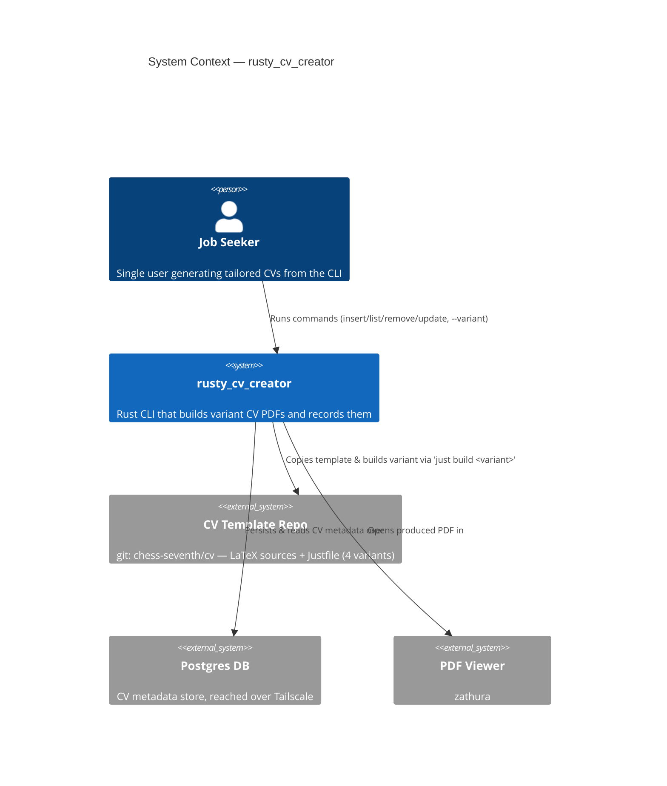
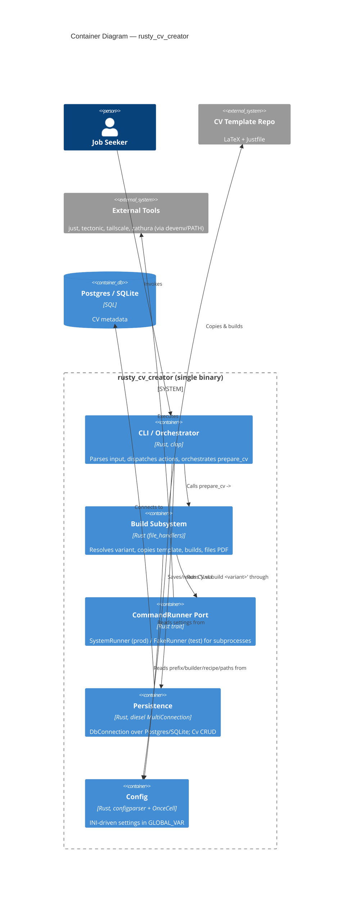
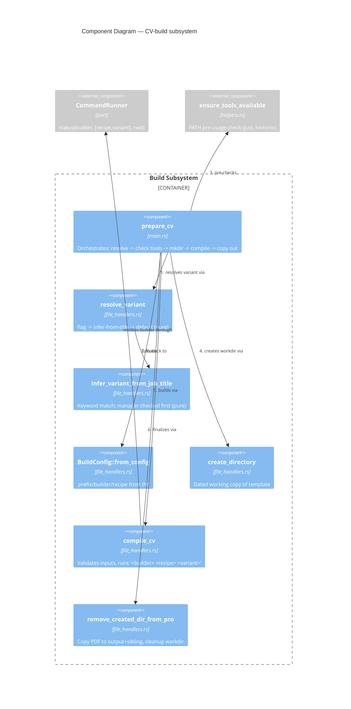
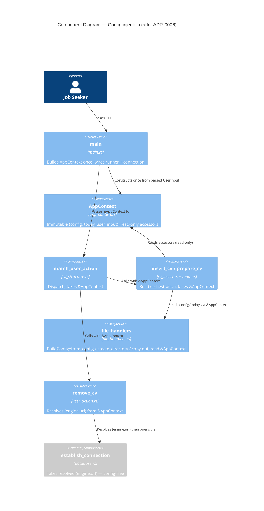
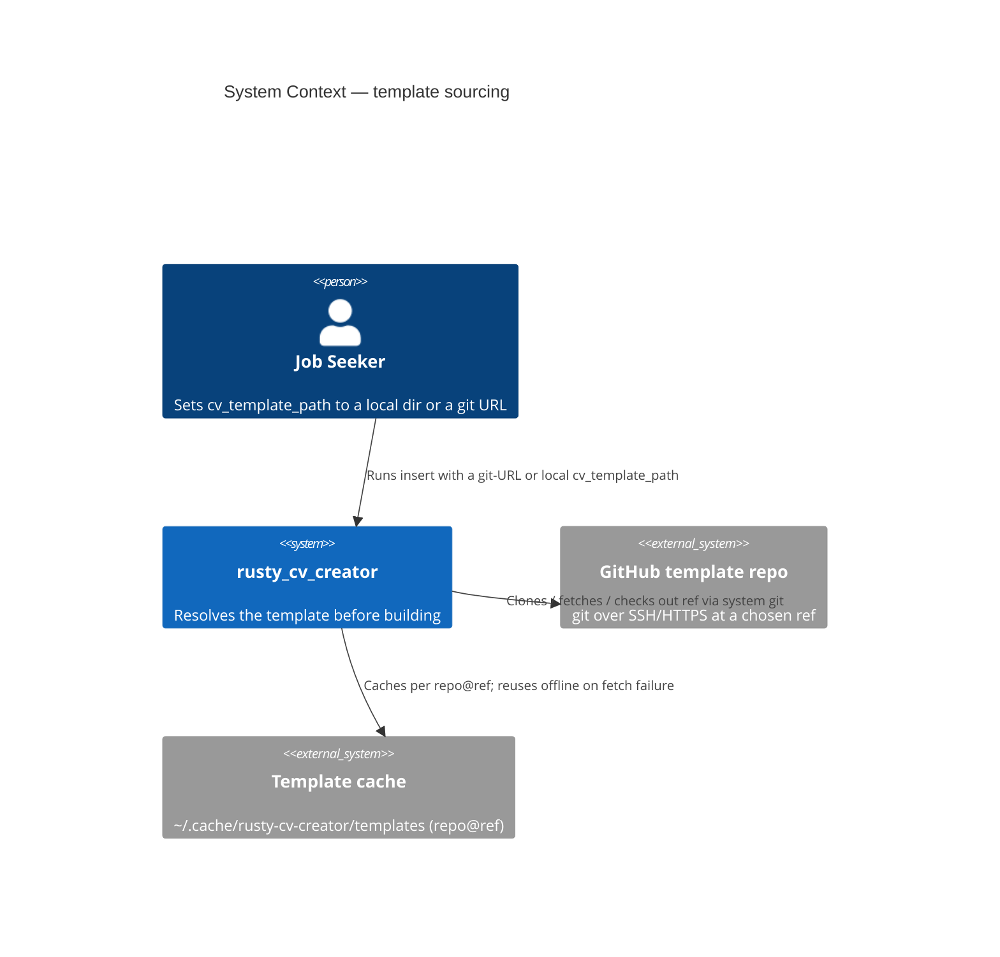
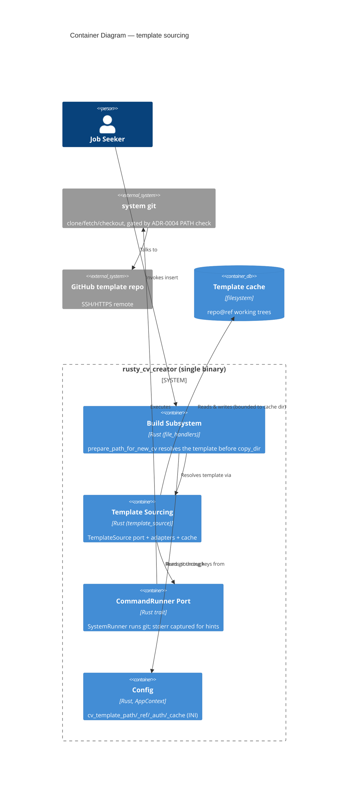
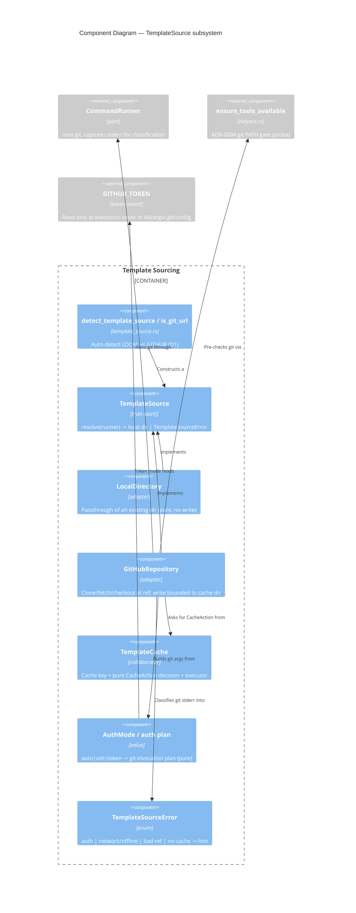

# C4 Diagrams — rusty_cv_creator

Retroactive documentation of the implemented architecture (v4.0.2). Levels:
System Context (L1), Container (L2), Component (L3, CV-build subsystem only).

## L1 — System Context

## L2 — Container

## L3 — Component: CV-build subsystem (`file_handlers` + orchestration)

## L3 — Config injection (feature `config-injection`, proposed — ADR-0006)

> Forward-looking. L1/L2 above are unchanged; the only delta is that the `Config`
> container stops being the process-global `GLOBAL_VAR` `OnceCell` and becomes an
> immutable `AppContext` value built once in `main` and passed inward by borrow.
> Contrast: **before**, every component reached the global getter; **after**,
> `&AppContext` flows down the call chain alongside the already-injected
> `CommandRunner` (ADR-0002) and `DbConnection` (ADR-0003).

## Template sourcing — feature `template-source` (ADR-0008)

### L1 — System Context (delta)

### L2 — Container (delta)

### L3 — Component: TemplateSource subsystem

