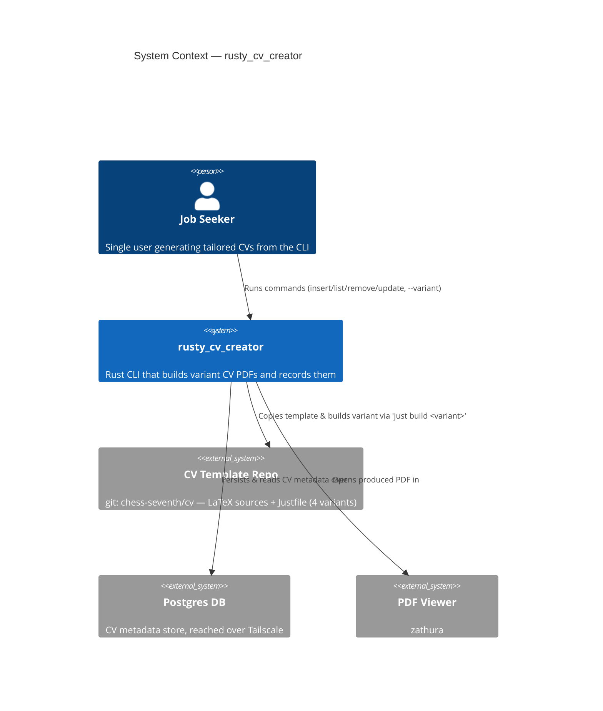
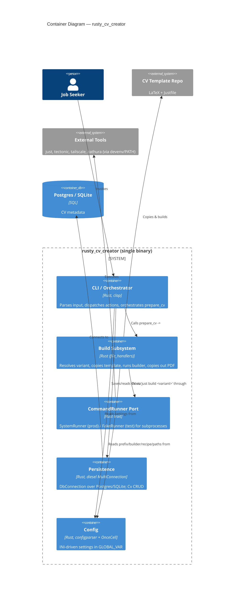
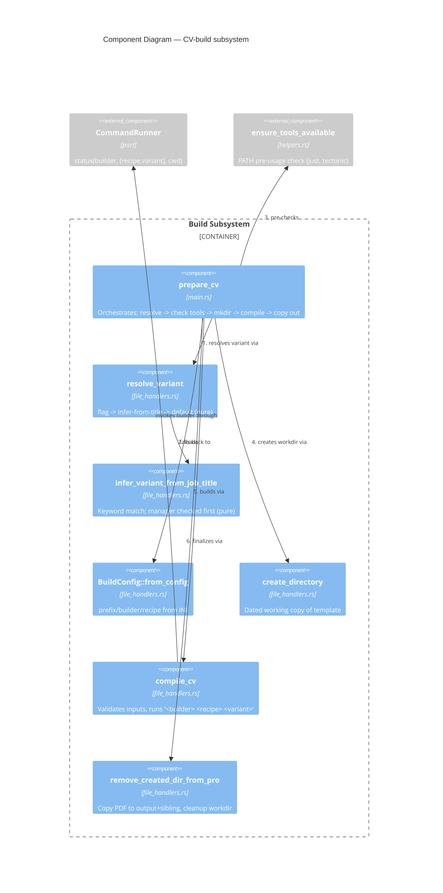

# C4 Diagrams — rusty_cv_creator

Retroactive documentation of the implemented architecture (v4.0.2). Levels:
System Context (L1), Container (L2), Component (L3, CV-build subsystem only).

## L1 — System Context

## L2 — Container

## L3 — Component: CV-build subsystem (`file_handlers` + orchestration)

